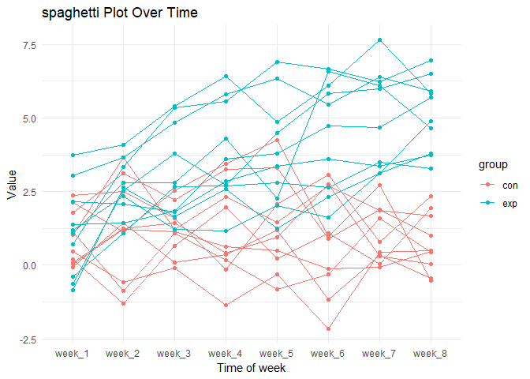
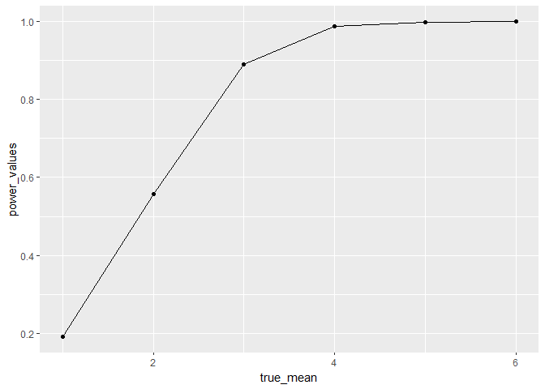
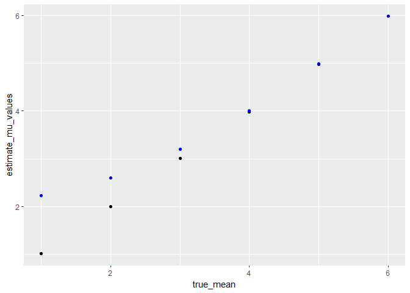

## R Markdown

This is an R Markdown document. Markdown is a simple formatting syntax
for authoring HTML, PDF, and MS Word documents. For more details on
using R Markdown see <http://rmarkdown.rstudio.com>.

When you click the **Knit** button a document will be generated that
includes both content as well as the output of any embedded R code
chunks within the document. You can embed an R code chunk like this:

``` r
summary(cars)
```

    ##      speed           dist       
    ##  Min.   : 4.0   Min.   :  2.00  
    ##  1st Qu.:12.0   1st Qu.: 26.00  
    ##  Median :15.0   Median : 36.00  
    ##  Mean   :15.4   Mean   : 42.98  
    ##  3rd Qu.:19.0   3rd Qu.: 56.00  
    ##  Max.   :25.0   Max.   :120.00

## Including Plots

You can also embed plots, for example:


Note that the `echo = FALSE` parameter was added to the code chunk to
prevent printing of the R code that generated the plot.

Problem 2

``` r
df <- list.files("data")

library(purrr)
library(dplyr)
library(tidyr)
library(ggplot2)

read_data <- function(file_name) {
  read.csv(file_name)
}
 
data <- purrr::map(paste("data/",df,sep = ""), read_data)

final.data <- bind_rows(data)

final.data <- final.data %>%
             mutate(name = df,
                     group = substr(name, 1,3),
                     id = c(1:20)) 

final.data.long <- final.data %>%
                  pivot_longer(cols = paste("week_", 1:8, sep = ""),
                  names_to = "week",
                   values_to =  "value") %>%
                  select(-name)


ggplot(final.data.long, aes(x = week, y = value, group = id, colour = group)) +
  geom_line() +
  geom_point() +
  labs(title = "spaghetti Plot Over Time",
       x = "Time of week",
       y =  "Value") +
  theme_minimal()
```


The mean value of experimental group is higher than control group among
eight weeks. There is also a sightly uptrend of value of the patients in
experimental group along with increasing time, while the value of the
control stays horizontal stable.

Problem 3

``` r
set.seed(123)

N_datasets <- 5000

list_datasets <- NULL

for(i in 1:N_datasets) {
  list_datasets[[1]] <- rnorm(30,0,5)
}

t.test.custom <- function(x) {
  t.test(x, mu = 0) %>% broom::tidy()
  
}

clean_result <- bind_rows(lapply(list_datasets, t.test.custom))
```

``` r
power_values <- rep(0, 6)

true_mean <- c(1:6)

estimate_mu_values <- rep(0, 6)

estimate_mu_values_rej <- rep(0, 6)

for(i in true_mean) {
for(j in 1:N_datasets) {
  
  list_datasets[[j]] <- rnorm(30, true_mean[i], 5)

}

clean_result <- bind_rows(lapply(list_datasets, t.test.custom))

power_values[i] <- sum(clean_result$p.value<0.05)/5000

estimate_mu_values[i] <- mean(clean_result$estimate)

estimate_mu_values_rej[i] <- mean(clean_result$estimate[clean_result$p.value<0.05])


}
```

``` r
data.plot <- data.frame(true_mean,
                        power_values = power_values)

ggplot(data.plot, aes(x = true_mean, y = power_values)) +
  geom_point() + geom_line()
```



``` r
data.plot <- data.frame(true_mean = true_mean,
                       estimeate_mu_values = estimate_mu_values,
                       estimate_mu_values_rej = estimate_mu_values_rej)

ggplot(data.plot, aes(x = true_mean, y = estimate_mu_values)) +
  geom_point() +
  geom_point(aes(x=true_mean, y = estimate_mu_values_rej),color = "blue")
```



The sample mean is not always equal to the true mean. With an increase
in the true mean, the rejection rate of the t-test with μ = 0 also
increases. This means that the average of the samples that are rejected
will be more approximately close to the true mean.
